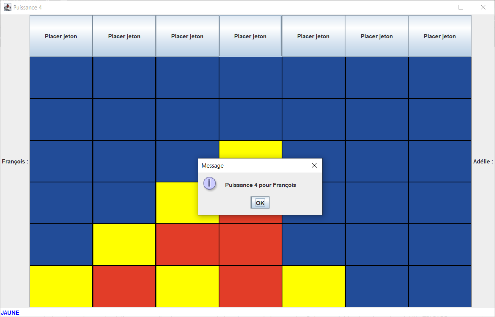

# A31_Project

Le but du projet est de réaliser une application permettant à deux joueurs de jouer au jeu Puissance 4.
Membre du projet :
Adélie TRICARD
François FOLTETE

#   Installation

L'installation s'effectue grâce à un .jar disponible [ici](https://git.unistra.fr/ffoltete/a31_project/-/blob/master/a31_project.jar)
La version de java nécessaire pour lancer celui-ci est jre 13.

#   Mode d'emploi

##  Règles du jeu

Les règles de notre version du puissance 4 sont les mêmes que celles du puissance 4 habituel; c'est-à-dire qu'il faut aligner 4 jetons de la même couleur pour gagner.

### Déposer un jeton

Pour déposer un jeton il suffit de cliquer sur le bouton __Poser Jeton__ au dessus de la colonne où l'on veut le déposer. En bas à gauche on voit la couleur du joueur courant.

 Le jeton se posera alors au plus bas dans cette colonne.

### Fin de la partie
A la fin de la partie une pop-up affiche le gagnant!

